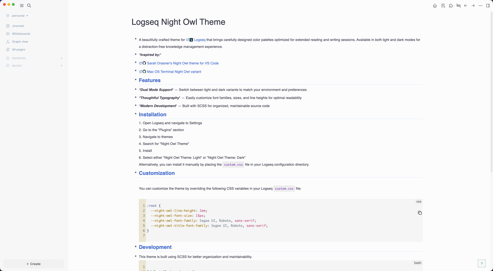
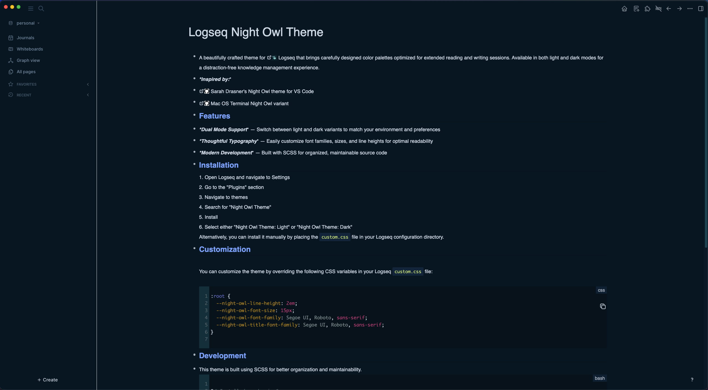

# Night Owl Theme for Logseq

A beautifully crafted theme for [Logseq](https://logseq.com/) that brings carefully designed color palettes optimized for extended reading and writing sessions. Available in both light and dark modes for a distraction-free knowledge management experience.

**Inspired by:**
- [Sarah Drasner's Night Owl theme for VS Code](https://github.com/sdras/night-owl-vscode-theme)
- [Mac OS Terminal Night Owl variant](https://github.com/lysyi3m/macos-terminal-themes?tab=readme-ov-file#night-owl-download)

## Light variant

## Dark variant

## Features

- **Dual Mode Support** — Switch between light and dark variants to match your environment and preferences
- **Modern Development** — Built with SCSS for organized, maintainable source code

## Installation

1. Open Logseq and navigate to Settings
2. Go to the "Plugins" section
3. Navigate to themes
4. Search for "Night Owl Theme"
5. Install
6. Select either "Night Owl Theme: Light" or "Night Owl Theme: Dark"

Alternatively, you can install it manually by placing the `custom.css` file in your Logseq configuration directory.

## Development

This theme is built using SCSS for better organization and maintainability.

```bash
# Install dependencies
npm install

# Build the theme
npm run build

# Watch for changes during development
npm run watch
```

## Support

If you have any questions, issues, or feature requests, please use the [GitHub issue tracker](https://github.com/PaulNoth/logseq-night-owl-theme/issues).

## License

[MIT License](./LICENSE)
